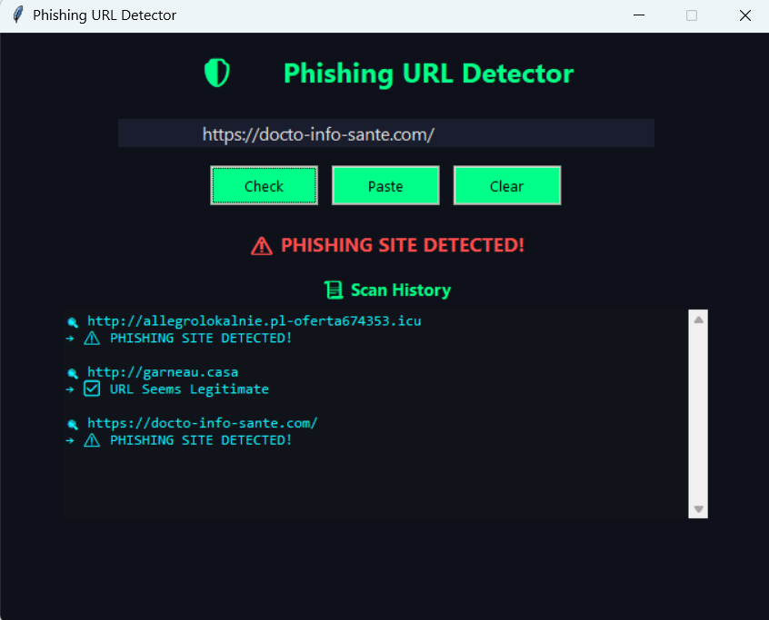

# 🛡️ Phishing URL Detector

A lightweight machine learning–based phishing URL detector built using handcrafted features, a Random Forest classifier, and an optional real-time check with PhishTank. Includes a GUI app with a professional dark cybersecurity theme.

---

## 🚀 Features

- ✅ Detects phishing URLs based on 16+ manually extracted features
- 🔍 Uses `RandomForestClassifier` for classification (97% accuracy)
- 🧠 Features include suspicious TLDs, IP usage, URL length, Levenshtein similarity to brand domains, and more
- 🖥️ Tkinter GUI with cyber-inspired neon UI
- 📦 Fully offline `.exe` version available (built with PyInstaller)
- 🔗 Optional: Verifies URLs via [PhishTank](https://phishtank.org/)

---

## 📊 ML Model Details

- **Algorithm**: RandomForestClassifier (n_estimators=100)
- **Accuracy**: ~97% on test set
- **Feature set**:
  - URL structure (dots, hyphens, subdomains, etc.)
  - Keyword detection (`login`, `paypal`, etc.)
  - Domain heuristics
  - String similarity to known brands
  - Digit and special character count

---

## 🖥️ GUI Demo

  
> Dark-mode GUI built with `tkinter`, styled like a cybersecurity tool

---

## 🧰 Tech Stack

- Python 3.11
- scikit-learn
- tkinter
- tldextract
- pyperclip
- joblib
- pyinstaller (for `.exe` packaging)

---

## 🧪 How to Run

### 🧠 Train the model (if needed)
```bash
python train_model.py
